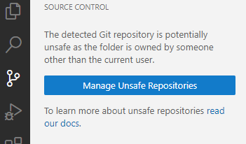

# How to use devcontainers

1. How to open a dev container:
    
    a. First time you will need to pull the docker image. You might need to login to ecr before that.

    b. open  Command Palette (F1) and choose **Dev Containers: open folder in conatainer...**

    c. Choose current directory.

    d. Choose the devconatiner you wnat to work with (CNV/Single cell/ etc...)

2. First time build devconatiner:

    a. long time. next time it won't need to build from scratch.

    b. will install git + git lfs.

    c. install and config uv.

    d. how to install vscdoe extensions.

    e. choose venv (./.venv/bin/python for the uv venv) (if not choosed automaticly)

    f. source control - choose "Manage Unsafe Repositories" and choose ugbio_utils to keep working as usual.

    

3. use as a regular vscode, run tests, use git etc...

4. optional - build the docker image from local Dockerfile [TODO!]

## Troubleshooting

- if something is worng with uv (something about hardlinks), just delete the folder .venv and run uv sync again.
