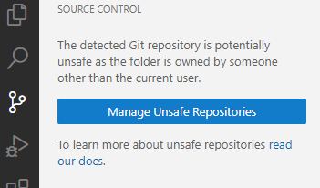
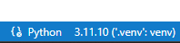
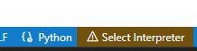

# ugbio-utils

This repository includes utilities for bioinformatics pipelines.

The package management in this project is done using [uv](https://docs.astral.sh/uv/).

## Virtual Environment: uv

### Install uv
1. `curl -LsSf https://astral.sh/uv/install.sh | sh`
2. Open a new terminal or run `source $HOME/.cargo/env` to add the uv command to PATH.

### Install the Virtual Environment
1. Change directory to the `ugbio_utils` repository root.
2. Run `uv sync`.

The virtual environment is called a **"workspace"** and each package in it is called a **"member"**.

### Update the Virtual Environment for a Specific Member
To work with the virtual environment of a specific member, run:

`uv sync --package <PACKAGE>`

For example, for cnv:

`uv sync --package ugbio-cnv`
### Pre-commit Tools
Pre-commit tools help maintain code quality and consistency by running checks before changes are committed to Git.

To install pre-commit tools, run `uv run pre-commit install`.
Once installed, these tools will automatically run checks whenever you commit to Git.
> VSCode users are recommended to install the Ruff extension.


## Adding a New ugbio Member
1. Create a new `<MEMBER_NAME>` folder under `src` for the new member. This folder should contain:
    - Dockerfile
    - pyproject.toml
    - README.<MEMBER_NAME>.md
    - `ugbio_<MEMBER_NAME>` folder for Python source code.
    - `tests` folder for Python tests.

2. The **Dockerfile** can be based on the `ugbio_base` image that contains common tools (ensure all tools are relevant to avoid large docker images).
3. In **pyproject.toml**, declare the dependencies and requirements. It can contain scripts to define executables. You **must include** these parts in your pyproject.toml:

    3.1 Add this section so uv understands that the current member is a published package:

        ```toml
        [build-system]
        requires = [
            "setuptools>=61.0",
        ]
        build-backend = "setuptools.build_meta"
        ```

    3.2 Declare the following `run_tests` script to allow running tests from the CI build:

        ```toml
        [project.scripts]
        run_tests = "pytest:main"
        ```

    3.3 If the current member depends on other members in the workspace (e.g., ugbio_core), add this section:

        ```toml
        [tool.uv.sources]
        ugbio_core = {workspace = true}
        ```
4. Optional - creating a devcontainer for the member. Steps:

    4.1. Create a folder with the memeber name under .devcontainer folder: `.devcontainer/<MEMBER_NAME>`

    4.2. Copy devcontainer.json from another folder (e.g. CNV folder) and paste under your new folder. Make sure you change:

    * The image name.
    * At the end of "postCreateCommand", change to your member name. E.g. change `ugbio_cnv` to `ugbio_<MEMBER>`

    4.3 Update Dockerfile with "app" user (You can skip this step if the member's DockerFile uses ugbio_base as base image):

    * Install `sudo` if not exists. Simply add it to the list under `RUN apt-get update && apt-get install -y ...`
    * Add this section:
        ```Dockerfile
        # Add user and grant sudo privileges (for using devconatiner)
        ARG USERNAME=app
        ARG USER_UID=1000
        ARG USER_GID=$USER_UID

        RUN groupadd --gid ${USER_GID} ${USERNAME} \
            && useradd --uid ${USER_UID} --gid ${USER_GID} -m ${USERNAME} -s /bin/bash \
            && echo "${USERNAME} ALL=(ALL) NOPASSWD:ALL" >> /etc/sudoers
        ```

### General guidelines for adding new code
* Look into ugbio_core! Probably someone already wrote a function that answers your needs. We want to avoid writing the same code in many places.
* Put your common functions in ugbio_core! If your code can be used in other places - it should be in the core so others can find and use it.


## Working with Dev Containers
To work in an environment with all necessary tools installed while still working on your code, it is recommended to develop inside a container, or in short - [dev container](https://containers.dev/).

For each member, you can find a `devcontainer.json` file under the `.devcontainer/<MEMBER_NAME>` folder. This file contains all the required setups for working with this container.

### Open Dev Container in VSCode
1. Install the *Dev Containers* extension.
2. The first time running the container, you will need to pull the Docker image from the registry. Make sure to <u>login to ecr</u> before that:

    `aws ecr get-login-password --region us-east-1 | docker login --username AWS --password-stdin 337532070941.dkr.ecr.us-east-1.amazonaws.com`

3. Open the Command Palette (F1) and choose **Dev Containers: Open Folder in Container...**
4. Choose the `ugbio-utils` root directory.
5. Choose the dev container you want to work with (CNV/Single cell/etc.).

> Note: The first time it may take some time to pull and build the necessary tools.

After following these steps, VSCode will open a new window. It will look the same, but you are actually working inside the container, with access to your `ugbio-utils` root directory. You will have installed:
* git
* git-lfs
* uv

> Note: The first time you open the source control panel, you may get this message:

Choose "Manage Unsafe Repositories" and select `ugbio_utils` to keep working as usual.

That's it! You are ready to use VSCode as before, but this time you can run tools and tests that are installed in the Docker image.


### Build from Local Dockerfile and Run in a Dev Container
If you want to check your Docker image after adding changes to the Dockerfile but don't want to push it to the registry yet, you can build the image and open it as a dev container. Steps:

1. Edit the file `.devcontainer/build_docker/devcontainer.json` and update the path to the Dockerfile (replace all \<PACKAGE\> placholders).
2. Follow the instructions above (Open Dev Container in VSCode: step 3 and choose "build_docker").

Note that building the Docker image will take a long time (much longer than just fetching it from the registry), and the build process will occur every time you open the dev container.

Another option is to build the image locally using `docker build . -f <dockerfile name> -t <image tag>` and use the image in the dev container (similar to other dev containers in this repository that are pulling the image from the registry).

### Mount Local Folders to the Dev Container
1. Open the relevant `devcontainer.json`.
2. Under "mounts", add:
    ```json
    "source=/local/source/path,target=/target/path/in/container,type=bind,consistency=cached"
    ```
3. Rebuild the container.

### Troubleshooting

- If there are issues with `uv` (e.g., problems with hardlinks), delete the `.venv` folder and run `uv sync` again.
- Ensure you are using the correct Python interpreter. It should look like this in the bottom right corner of your VSCode: 
(and not like this: ).

    - If you have the correct Python interpreter but things are still not working, close and re-open the container (no need to rebuild).
    - If you are trying to select the correct Python interpreter but things are still stuck, close and re-open the container. Sometimes VSCode needs to reload itself.

## Run Tests
It is recommended to run tests in the relevant dev container. See the section above for more details on how to open the dev container. Once you are running inside the dev container, you can run tests using VSCode or with `uv run pytest <tests path>`.

Alternatively, you can take advantage of the "run_tests" entry point we are adding to each Docker. Simply run:

```sh
docker run --rm -v .:/workdir <docker image> run_tests /workdir/src/<path>
```
