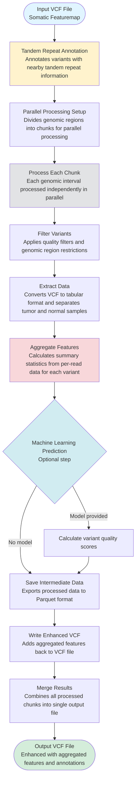

# Somatic Featuremap Fields Transformation - Flow Diagram

## Overview

This script transforms a somatic featuremap VCF file by adding aggregated features, tandem repeat annotations, and optional machine learning predictions. The process is designed to handle large files efficiently through parallel processing.

## Main Processing Flow

## Step Descriptions

### 1. Tandem Repeat Annotation
**Purpose:** Enriches variants with information about nearby tandem repeat regions.
Tandem repeats are DNA sequences where a short pattern (the repeat unit) repeats consecutively. For example, if the unit is "ATG", a tandem repeat might look like: ATGATGATGATGATG...

**What it does:**
- Identifies the closest tandem repeat to each variant
- Calculates distance from variant to tandem repeat
- Adds information about repeat sequence, length, and position

**Why it's needed:** Tandem repeats can affect variant calling accuracy and are important for understanding variant context.

---

### 2. Parallel Processing Setup
**Purpose:** Enables efficient processing of large VCF files by dividing work across multiple CPU cores.

**What it does:**
- Reads a BED file containing genomic regions of interest
- Divides regions into approximately equal-sized chunks
- Prepares chunks for parallel execution

**Why it's needed:** Large VCF files can contain millions of variants. Parallel processing significantly reduces computation time.

---

### 3. Process Each Chunk (Parallel Execution)
Each genomic chunk is processed independently. The following steps are applied to each chunk:

#### 3.1 Filter Variants
**Purpose:** Reduces the dataset to high-quality variants in regions of interest.

**What it does:**
- Applies quality filters (e.g., PASS filter)
- Restricts to specified genomic intervals
- Removes low-quality or unwanted variants

**Why it's needed:** Focuses computational resources on relevant, high-confidence variants.

---

#### 3.2 Extract Data
**Purpose:** Converts VCF format to a tabular structure for easier computation.

**What it does:**
- Separates tumor and normal sample data
- Converts VCF records to DataFrame rows
- Preserves original record order for later matching
- Normalizes column names and structure

**Why it's needed:** DataFrames enable efficient bulk operations and feature calculations.

---

#### 3.3 Aggregate Features
**Purpose:** Transforms per-read measurements into per-variant summary statistics.

**What it does:**
- **Quality Metrics:** Calculates min, max, and mean values for read quality scores
- **Read Counts:** Counts alternative allele supporting reads and filtered reads
- **Strand Information:** Counts forward and reverse strand reads
- **Duplicate Handling:** Separates duplicate and non-duplicate reads
- **Allele Information:** Extracts reference and alternative alleles
- **Depth Calculation:** Computes read depth from component counts

**Why it's needed:** Machine learning models and downstream analysis require per-variant features rather than per-read data.

---

#### 3.4 Machine Learning Prediction (Optional)
**Purpose:** Assigns quality scores to variants using a trained model.

**What it does:**
- Loads a pre-trained XGBoost model
- Uses aggregated features to predict variant quality
- Assigns probability scores to each variant

**Why it's needed:** Helps prioritize variants for further analysis or validation.

---

#### 3.5 Save Intermediate Data
**Purpose:** Preserves processed data for downstream analysis or debugging.

**What it does:**
- Exports the complete feature matrix to Parquet format
- Includes all original and aggregated features

**Why it's needed:** Allows analysis without re-processing the VCF file.

---

#### 3.6 Write Enhanced VCF
**Purpose:** Adds computed features back to the VCF file format.

**What it does:**
- Matches processed variants with original VCF records
- Adds aggregated features as new FORMAT fields (per sample)
- Adds variant-level annotations as INFO fields
- Includes machine learning predictions if available
- Preserves all original VCF data

**Why it's needed:** Maintains VCF compatibility while adding new information.

---

### 4. Merge Results
**Purpose:** Combines all processed chunks into a single output file.

**What it does:**
- Concatenates VCF files from all parallel chunks
- Sorts variants by genomic position
- Creates index for efficient querying

**Why it's needed:** Produces a single, ordered output file matching the input structure.

---

## Output

The final VCF file contains:
- **All original data** from the input VCF
- **Tandem repeat annotations** for each variant
- **Aggregated quality metrics** calculated from per-read data
- **Read count summaries** (alternative reads, strand counts, duplicates)
- **Machine learning predictions** (if model provided)
- **Proper VCF formatting** with updated headers and indexing

