# Somatic Featuremap Fields Transformation - Optimization Plan

## Executive Summary

This document outlines a comprehensive optimization plan for the `somatic_featuremap_fields_transformation.py` script. The goal is to convert it from a multi-threaded, resource-consuming implementation to an efficient single-threaded design optimized for latency.

**Target Use Case:** Each script invocation processes an already-chunked VCF file (parallelization/splitting is handled externally by the pipeline). The script should process the **entire input file** without additional region filtering.

**Expected Improvement:** 3-5x faster end-to-end execution.

---

## Current Architecture Analysis

### Current Data Flow

```mermaid
flowchart TD
    subgraph Input
        A[("Input VCF<br/>Somatic Featuremap")]
    end

    subgraph TR["Tandem Repeat Integration"]
        B1["bcftools query<br/>(create BED)"]
        B2["bedtools closest<br/>(find TR)"]
        B3["sort + bgzip + tabix<br/>(prepare annotation)"]
        B4["bcftools annotate<br/>(add TR fields)"]
        B1 --> B2 --> B3 --> B4
    end

    subgraph Parallel["ThreadPoolExecutor (REDUNDANT)"]
        direction TB
        C1["Chunk 1"]
        C2["Chunk 2"]
        C3["Chunk N"]
    end

    subgraph ChunkProcess["Per-Chunk Processing"]
        D1["bcftools view<br/>(filter PASS + region)"]
        D2["bcftools index"]
        D3["get_vcf_df(tumor)<br/>⚠️ FULL READ #1"]
        D4["get_vcf_df(normal)<br/>⚠️ FULL READ #2"]
        D5["DataFrame .apply()<br/>⚠️ SLOW LAMBDAS"]
        D6["XGBoost inference"]
        D7["Write parquet"]
        D8["pysam write VCF"]
        D9["tabix index"]
        D1 --> D2 --> D3 --> D4 --> D5 --> D6 --> D7 --> D8 --> D9
    end

    subgraph Merge["Final Merge"]
        E1["bcftools concat"]
        E2["bcftools sort"]
        E3["bcftools index"]
        E1 --> E2 --> E3
    end

    subgraph Output
        F[("Output VCF<br/>Enhanced")]
    end

    A --> TR
    TR --> Parallel
    Parallel --> C1 & C2 & C3
    C1 & C2 & C3 --> ChunkProcess
    ChunkProcess --> Merge
    Merge --> F

    style D3 fill:#ffcccc
    style D4 fill:#ffcccc
    style D5 fill:#ffcccc
    style Parallel fill:#fff3cd
```

### Identified Performance Bottlenecks

### Bottleneck Details

| Issue | Location | Impact | Severity |
|-------|----------|--------|----------|
| **Double VCF Read** | `read_merged_tumor_normal_vcf()` L317-321 | 2x I/O time, 2x memory | 🔴 Critical |
| **Slow `.apply()` with lambdas** | `process_sample_columns()`, `add_agg_features()` | O(n) Python interpreter overhead per row | 🔴 Critical |
| **Unnecessary ThreadPoolExecutor** | `featuremap_fields_aggregation_on_an_interval_list()` | Thread overhead when input is already chunked | 🟡 Medium |
| **Unnecessary BED-based region splitting** | `collapse_bed_by_chunks()` | Redundant for pre-chunked input | 🟡 Medium |
| **Multiple temp files** | Throughout | Disk I/O latency, cleanup overhead | 🟡 Medium |
| **Redundant bcftools calls** | TR integration + filtering | Process spawn overhead | 🟡 Medium |
| **Two-pass VCF write** | DataFrame → VCF lookup by position | O(n×m) matching overhead | 🟡 Medium |

---

## Proposed Optimized Architecture

### Optimized Data Flow

### Comparison: Before vs After

```mermaid
flowchart LR
    subgraph Before["❌ BEFORE"]
        direction TB
        B1["BED-based chunking<br/>(unnecessary)"]
        B2["VCF Read #1<br/>(tumor)"]
        B3["VCF Read #2<br/>(normal)"]
        B4["VCF Read #3<br/>(write pass)"]
        B5["5+ Temp Files"]
        B6["ThreadPoolExecutor"]
        B7["bcftools concat/sort"]
        B8[".apply() Lambdas"]
    end

    subgraph After["✅ AFTER"]
        direction TB
        A1["Process entire<br/>input file"]
        A2["Single VCF Read<br/>(both samples)"]
        A3["0-1 Temp Files"]
        A4["Single-threaded"]
        A5["No concat needed"]
        A6["Vectorized/Polars"]
    end

    Before -.->|"Optimize"| After

    style Before fill:#ffcccc
    style After fill:#d4edda
```

---

## Step-by-Step Optimization Plan

### Step 1: Remove Unnecessary Parallelization and Region Filtering

**Priority:** 🔴 High | **Effort:** Low | **Impact:** High

**Current Problem:** 
- The input VCF is already a small chunk from the original VCF (chunking done externally)
- The script unnecessarily re-chunks using `collapse_bed_by_chunks()` 
- Uses `ThreadPoolExecutor` for parallel processing that adds overhead
- Requires `bcftools concat/sort` to merge results

**Solution:**
- Remove `featuremap_fields_aggregation_on_an_interval_list()` entirely
- Remove `collapse_bed_by_chunks()` function
- Have `run()` call `featuremap_fields_aggregation()` directly
- Process the **entire input VCF** without region filtering
- Remove the genomic_regions_bed_file argument from CLI

**Expected Gain:** Eliminates thread overhead, temp file concatenation, bcftools concat/sort, and BED parsing.

---

### Step 2: Merge TR Integration with Filtering (Preserve Record Order)

**Priority:** 🟡 Medium | **Effort:** Medium | **Impact:** Medium

**Critical Consideration: Preserving Record Order**

Since we're removing the final `bcftools sort`, we must ensure record order is preserved throughout:

| Tool | Order Preservation | Notes |
|------|-------------------|-------|
| `bcftools view -f PASS` | ✅ Yes | Streaming filter, maintains order |
| `bedtools closest -D ref` | ✅ Yes | Processes records in input order |
| `bcftools annotate` | ✅ Yes | Annotates in-place, maintains order |

**Solution:** 
- Combine filtering and TR annotation into a single piped command
- Avoid intermediate sorting steps
- All tools in the pipeline preserve input order

**Alternative: In-Memory Processing**

For small chunks, avoid temp files entirely by:
1. Extracting VCF positions in memory
2. Finding closest TR for each position (maintains order)
3. Annotating VCF in a streaming fashion

**Expected Gain:** Single I/O pass, reduced subprocess overhead, guaranteed order preservation.

---

### Step 3: Memory-Efficient VCF to DataFrame Conversion

**Priority:** 🔴 High | **Effort:** Medium-High | **Impact:** High

#### Why Use bcftools query?

| Aspect | pysam (Current) | bcftools query (Proposed) |
|--------|-----------------|---------------------------|
| **Memory Model** | Loads entire VCF structure into Python objects | Streams TSV text, never loads full VCF |
| **Field Selection** | Extracts all fields, filters in Python | Extracts only requested fields at C level |
| **Speed** | Python object creation overhead per record | Compiled C, outputs flat text |
| **Two-sample handling** | Requires two separate reads | Single pass with `[%field]` syntax for samples |
| **Memory for 100K variants** | ~500MB-1GB (Python objects) | ~50-100MB (flat text → DataFrame) |
| **Null handling** | Complex Python logic | Built-in `.` handling |

**Key Benefits:**
1. **Selective Extraction** - Only extracts fields you need, not entire VCF structure
2. **Streaming** - Data flows through pipe, never fully loaded
3. **C-level Performance** - bcftools is highly optimized C code
4. **Flat Output** - TSV is trivial to parse into DataFrame

#### Auto-Discovery Approach

**Problem:** Hardcoded field lists are fragile. When a VCF field is added/renamed/removed, code changes are required.

**Solution:** Automatically discover fields from the VCF header at runtime.

**How Auto-Discovery Works:**

1. **Header Parsing**: Read the VCF header to extract all INFO and FORMAT field definitions
2. **Type Mapping**: Map VCF types (Integer, Float, String, Flag) to Polars types (Int64, Float64, Utf8, Boolean)
3. **Field Classification**: Use the `Number` attribute to classify fields:
   - `Number=1` → Scalar field (single value per sample)
   - `Number=.` or `R` or `A` or `G` → List field (variable length, needs aggregation)
4. **Dynamic Query Building**: Construct the bcftools query format string from discovered fields
5. **Dynamic Schema**: Build the Polars schema from discovered field types

**Handling Field Changes with Auto-Discovery:**

| Scenario | With Hardcoded Schema | With Auto-Discovery |
|----------|----------------------|---------------------|
| **Add new INFO field** | Edit Python code, redeploy | ✅ Automatically detected |
| **Rename FORMAT field** | Find/replace in code, test | ✅ Automatically detected |
| **Remove field from VCF** | Code may break with KeyError | ✅ Gracefully handled |
| **Change field type** | May cause type errors | ✅ Automatically adapts |
| **Different VCF versions** | Requires code branches | ✅ Works with any version |

**Reference Implementation:** 

The existing `featuremap_to_dataframe.py` uses this pattern:
- `header_meta()` function parses VCF header to discover INFO/FORMAT fields
- Regex patterns extract field ID, Number, Type, and Description
- Query string and schema are built dynamically from discovered metadata

**Aggregation Configuration:**

While field discovery is automatic, aggregation rules can be specified in a simple config:

| Field Pattern | Default Aggregation |
|---------------|---------------------|
| Quality scores (MQUAL, SNVQ, MAPQ) | min, max, mean |
| Counts/flags (FILT, DUP) | sum, count |
| Strand info (REV) | count_0, count_1 |
| Other numeric lists | mean |

This allows adding new fields without code changes while maintaining control over how they're processed.

#### Memory Comparison

| Approach | Memory Usage | Speed | Maintainability |
|----------|--------------|-------|-----------------|
| Current (Pandas, 2x read, hardcoded) | 100% (baseline) | Slow | ❌ Code changes required |
| Polars + bcftools + hardcoded schema | ~25% | Fast | ❌ Code changes required |
| Polars + bcftools + auto-discovery | ~25% | Fast | ✅ Automatic adaptation |

**Expected Gain:** 60-70% memory reduction, 2-5x faster DataFrame creation, zero maintenance for field changes.

---

### Step 4: Replace `.apply()` with Vectorized NumPy Operations

**Priority:** 🔴 High | **Effort:** High | **Impact:** Very High

#### Comparison: Pre-processing During Read vs Batch explode+groupby

| Aspect | Option A: Pre-process During Read | Option B: Batch explode+groupby |
|--------|-----------------------------------|--------------------------------|
| **Description** | Compute min/max/mean as each record is read | Load all data, explode lists, then aggregate |
| **Memory Usage** | ✅ **Low** - only scalars stored | ❌ **High** - exploded DataFrame can be 10-100x larger |
| **Code Complexity** | 🟡 Medium - logic in read loop | ✅ **Low** - clean Polars/Pandas operations |
| **Maintainability** | 🟡 Aggregation logic coupled with I/O | ✅ **Better** - separation of concerns |
| **Flexibility** | ❌ Must know aggregations upfront | ✅ **Easy** to add new aggregations |
| **Speed (small data)** | ✅ Faster - single pass | 🟡 Overhead of explode operation |
| **Speed (large data)** | ✅ **Faster** - no memory pressure | ❌ Memory allocation slows down |
| **Debugging** | 🟡 Harder - logic embedded in loop | ✅ **Easier** - can inspect intermediate states |
| **Parallelization** | ❌ Sequential by nature | ✅ Can parallelize groupby |
| **Error Handling** | ❌ Errors during read harder to debug | ✅ **Better** - clear error locations |

#### Recommendation

**For this use case: Option A (Pre-process During Read)** is recommended because:

1. **Memory is critical** - VCF files with per-read data can have 10-100 values per variant
2. **Aggregations are fixed** - we know exactly which aggregations we need (min/max/mean)
3. **Single-threaded requirement** - no parallelization benefit from Option B
4. **Latency focus** - avoiding memory pressure reduces GC overhead

**When to Use Option B Instead:**
- If aggregations need to change frequently
- If debugging/development phase requires inspection
- If data fits comfortably in memory with room to spare
- If using Polars' lazy evaluation can defer computation

**Expected Gain:** 10-100x speedup vs `.apply()` with lambda functions.

---

### Step 5: VCF Record Writing

**Priority:** 🟡 Medium | **Effort:** Medium | **Impact:** Medium

```mermaid
flowchart LR
    subgraph CurrentApproach["Current: Read → Process → Re-read → Write"]
        A1["Read VCF to DataFrame"]
        A2["Process/Transform DataFrame"]
        A3["Run ML inference"]
        A4["Re-read VCF for writing"]
        A5["Match records by chrom/pos/alt"]
        A6["Write enhanced records"]
        A1 --> A2 --> A3 --> A4 --> A5 --> A6
    end

    subgraph BatchWrite["Option A: Batch Write with Lookup"]
        B1["Read VCF to DataFrame"]
        B2["Process/Transform"]
        B3["ML inference on batch"]
        B4["Create lookup dict<br/>{(chrom,pos,alt): record}"]
        B5["Re-read VCF, O(1) lookup"]
        B6["Write enhanced records"]
        B1 --> B2 --> B3 --> B4 --> B5 --> B6
    end

    subgraph StreamingWrite["Option B: Streaming Write"]
        C1["Read VCF record"]
        C2["Extract & aggregate features"]
        C3["Accumulate feature vectors"]
        C4["After all records:<br/>batch ML inference"]
        C5["Re-read VCF with<br/>pre-computed scores"]
        C6["Write enhanced records"]
        C1 --> C2 --> C3 --> C4 --> C5 --> C6
    end

    style B4 fill:#d4edda
    CurrentApproach --> BatchWrite
    CurrentApproach --> StreamingWrite
```

#### VCF Writing Options - Trade-off Table

| Aspect | Option A: Batch Write with Lookup | Option B: Streaming Write |
|--------|-----------------------------------|---------------------------|
| **Memory Usage** | 🟡 Medium - full DataFrame + lookup dict | ✅ **Low** - only feature matrix stored |
| **Implementation Complexity** | ✅ **Low** - straightforward dict lookup | 🟡 Medium - two-phase processing |
| **VCF Read Passes** | 2 passes | 2 passes |
| **Lookup Speed** | ✅ O(1) per record | ✅ O(1) by index |
| **Data Availability** | ✅ Full DataFrame available for debugging | ❌ Only aggregated features available |
| **Flexibility** | ✅ Can add fields after processing | ❌ Must define features upfront |
| **Error Recovery** | ✅ Can retry individual records | 🟡 Must restart from beginning |
| **Code Maintainability** | ✅ Familiar patterns | 🟡 More complex state management |
| **Best For** | Most use cases, development/debugging | Memory-constrained environments |

#### Option B: Streaming Write - How It Works

#### Memory Comparison

| Approach | Memory Formula | Example (10K variants, 50 reads each) |
|----------|----------------|--------------------------------------|
| Current (full DataFrame) | O(n_variants × n_reads × n_fields) | ~500MB |
| Option A (Batch + lookup) | O(n_variants × n_fields) + lookup overhead | ~100MB |
| Option B (Streaming) | O(n_variants × n_features) | ~5MB |

#### Recommendation

- **Default:** Use **Option A (Batch Write with Lookup)** for simplicity and debuggability
- **Memory-constrained:** Use **Option B (Streaming)** when processing very large files or running in limited memory environments

---

### Step 6: Optimize XGBoost Inference

**Priority:** 🟡 Medium | **Effort:** Low | **Impact:** Medium

#### Will the Suggested Changes Affect Inference Results?

**Short Answer: NO** - The results will be **identical** if:

1. ✅ Same XGBoost model file is used
2. ✅ Same features are extracted from the VCF
3. ✅ Feature values are computed the same way

#### Analysis of Proposed Changes

| Change | Affects Features? | Affects Results? | Explanation |
|--------|-------------------|------------------|-------------|
| Remove ThreadPoolExecutor | ❌ No | ❌ No | Processing order doesn't affect features |
| Single-pass VCF read | ❌ No | ❌ No | Same data extracted, just more efficiently |
| Vectorized aggregations | ⚠️ Potentially | ⚠️ See below | Floating-point precision considerations |
| Polars instead of Pandas | ⚠️ Potentially | ⚠️ See below | Different null handling possible |
| Pre-encoding categoricals | ❌ No | ❌ No | Same encoding, just done earlier |

#### Potential Precision Differences

NumPy vs Python built-in can have tiny precision differences (~1e-16), which is negligible for XGBoost decision trees.

#### Guarantees

- ✅ Same model + same features + same values = **identical predictions**
- ✅ Using `xgb.DMatrix` instead of DataFrame doesn't change predictions
- ✅ Pre-encoding categoricals doesn't change predictions (same encoding scheme)

#### Validation Strategy

Before deployment, run both old and new implementations on test data and compare:
- Maximum difference in probability scores should be < 1e-10
- Same ranking of variants by score

---

### Step 7: Memory-Efficient Data Structures

**Priority:** 🟢 Low | **Effort:** Medium | **Impact:** Low-Medium

**Current Issues:**
- Full DataFrame with many redundant columns (lowercase duplicates, prefixed columns)
- Python lists stored in DataFrame cells (inefficient)
- Column duplication during lowercase conversion

**Solutions:**
- Use Polars instead of Pandas (adopting `featuremap_to_dataframe.py` approach)
- Pre-allocate arrays of known size when possible
- Avoid column duplication (rename in-place instead of copy)
- Use `category` dtype for repeated strings

**Expected Gain:** Reduced memory pressure, better cache locality.

---

### Step 8: Eliminate Redundant Parquet Write

**Priority:** 🟢 Low | **Effort:** Very Low | **Impact:** Low

**Current:** Always writes parquet file alongside VCF output.

**Solution:** Make parquet output optional via command-line flag. Skip when not needed.

**Expected Gain:** Eliminates unnecessary disk I/O when parquet not needed.

---

## Implementation Roadmap

### Recommended Implementation Order

| Order | Step | Priority | Effort | Impact | Reason |
|-------|------|----------|--------|--------|--------|
| 1 | Step 1 | 🔴 High | Low | High | Quick win, removes unnecessary complexity |
| 2 | Step 2 | 🟡 Medium | Medium | Medium | Simplifies pipeline, preserves order |
| 3 | Step 3 | 🔴 High | Medium-High | High | Major I/O improvement, adopt proven pattern |
| 4 | Step 4 | 🔴 High | High | Very High | Major compute improvement |
| 5 | Step 5 | 🟡 Medium | Medium | Medium | Memory optimization for write phase |
| 6 | Step 6 | 🟡 Medium | Low | N/A | Validation only, ensures correctness |
| 7 | Step 7 | 🟢 Low | Medium | Low-Medium | Memory optimization |
| 8 | Step 8 | 🟢 Low | Very Low | Low | Final polish |

---

## Expected Performance Improvement

| Metric | Before | After | Improvement |
|--------|--------|-------|-------------|
| **I/O time** | 100% (baseline) | 30-40% | 60-70% reduction |
| **Compute time** | 100% (baseline) | 2-10% | 10-50x faster aggregations |
| **Memory footprint** | 100% (baseline) | 40-50% | 50-60% reduction |
| **Overall latency** | 100% (baseline) | 20-33% | **3-5x faster** |

---

## Testing Strategy

### Unit Tests
- [ ] Test single-pass VCF reading with both samples
- [ ] Test auto-discovery of VCF fields
- [ ] Test vectorized aggregation functions
- [ ] Test XGBoost inference result consistency
- [ ] Test VCF writing with new fields
- [ ] Test order preservation in preprocessing

### Integration Tests
- [ ] Compare output VCF with current implementation (should match exactly)
- [ ] Validate XGBoost probability scores match original
- [ ] Validate parquet output matches
- [ ] Test with various VCF sizes
- [ ] Test edge cases (empty VCF, single variant, multi-allelic sites)

### Performance Tests
- [ ] Benchmark with small VCF (100 variants)
- [ ] Benchmark with medium VCF (10,000 variants)
- [ ] Benchmark with large VCF (1,000,000 variants)
- [ ] Memory profiling
- [ ] I/O profiling

---

## Risk Assessment

| Risk | Likelihood | Impact | Mitigation |
|------|------------|--------|------------|
| Output differs from current | Medium | High | Comprehensive test suite comparing outputs |
| XGBoost results differ | Low | High | Validate with bit-exact comparison |
| Order not preserved | Low | High | Unit tests for order preservation |
| Edge cases break | Medium | Medium | Test with diverse VCF files |
| Memory issues with large files | Low | Medium | Streaming approach for very large files |
| Auto-discovery misses fields | Low | Medium | Fallback to explicit field list |

---

## Appendix: Code Locations

| Component | File | Lines |
|-----------|------|-------|
| Main entry point | `somatic_featuremap_fields_transformation.py` | 656-680 |
| Parallel processing (remove) | `somatic_featuremap_fields_transformation.py` | 519-586 |
| BED chunking (remove) | `somatic_featuremap_fields_transformation.py` | 459-516 |
| Double VCF read | `somatic_featuremap_fields_transformation.py` | 289-344 |
| Slow aggregations | `somatic_featuremap_fields_transformation.py` | 63-161 |
| VCF writing | `somatic_featuremap_fields_transformation.py` | 215-286 |
| TR integration | `somatic_featuremap_utils.py` | 62-121 |
| XGBoost inference | `somatic_featuremap_inference_utils.py` | 56-88 |
| Reference: Auto-discovery | `featuremap_to_dataframe.py` | 160-197 (`header_meta()`) |
| Reference: Memory-efficient VCF read | `featuremap_to_dataframe.py` | 497-612 |
